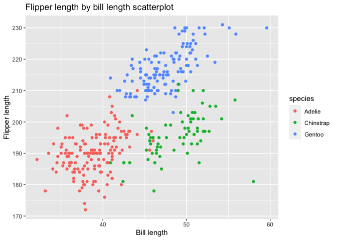

Homework 1
================
E. Brennan Bollman

This is my solution to homework 1.

``` r
library(tidyverse)
```

    ## ── Attaching packages ──────────────────────────────────────────────────────────── tidyverse 1.3.0 ──

    ## ✓ ggplot2 3.3.2     ✓ purrr   0.3.4
    ## ✓ tibble  3.0.3     ✓ dplyr   1.0.2
    ## ✓ tidyr   1.1.2     ✓ stringr 1.4.0
    ## ✓ readr   1.3.1     ✓ forcats 0.5.0

    ## ── Conflicts ─────────────────────────────────────────────────────────────── tidyverse_conflicts() ──
    ## x dplyr::filter() masks stats::filter()
    ## x dplyr::lag()    masks stats::lag()

## Problem 1

##### Step 1: Create a date frame with the specified elements.

``` r
prob1_df =
  tibble(
    samp = rnorm(10),
    samp_gt_0 = samp > 0,
    char_vec = c("a", "b", "c", "d", "e", "f", "g", "h", "i", "j"),
    factor_vec = factor(c("low", "low", "low", "mod", "mod", "mod", "mod", "high", "high", "high"))
  )
prob1_df
```

    ## # A tibble: 10 x 4
    ##      samp samp_gt_0 char_vec factor_vec
    ##     <dbl> <lgl>     <chr>    <fct>     
    ##  1 -0.101 FALSE     a        low       
    ##  2  0.459 TRUE      b        low       
    ##  3 -0.592 FALSE     c        low       
    ##  4  0.351 TRUE      d        mod       
    ##  5 -1.23  FALSE     e        mod       
    ##  6 -0.895 FALSE     f        mod       
    ##  7 -0.854 FALSE     g        mod       
    ##  8 -0.249 FALSE     h        high      
    ##  9 -0.393 FALSE     i        high      
    ## 10 -0.201 FALSE     j        high

##### Step 2: Take the mean of each variable in my prob1\_df data frame.

``` r
mean(pull(prob1_df, samp))
```

    ## [1] -0.3704216

``` r
mean(pull(prob1_df, samp_gt_0))
```

    ## [1] 0.2

``` r
mean(pull(prob1_df, char_vec))
```

    ## Warning in mean.default(pull(prob1_df, char_vec)): argument is not numeric or
    ## logical: returning NA

    ## [1] NA

``` r
mean(pull(prob1_df, factor_vec))
```

    ## Warning in mean.default(pull(prob1_df, factor_vec)): argument is not numeric or
    ## logical: returning NA

    ## [1] NA

Note: can take mean of numbers and logical vectors, but not character or
factor vectors. The logical vector mean uses false=0 and true=1 to
calculate a mean. This makes sense\!

##### Step 3: Pull each prob1\_df variables with as.numeric function to evaluate conversion to numbers.

``` r
as.numeric(pull(prob1_df, samp))
as.numeric(pull(prob1_df, samp_gt_0))
as.numeric(pull(prob1_df, char_vec))
as.numeric(pull(prob1_df, factor_vec))
```

Note: when using as.numeric function, can convert factor to number, but
this does not work with character vectors. Because this factor variable
has 3 levels, R converts it to numbers 1,2,3. R seems to think
characters are really not translatable to numbers.

##### Step 4: practice manipulations, converting logical vector to numeric or factor and multiplications.

``` r
as.numeric(pull(prob1_df, samp_gt_0)) * pull(prob1_df, samp)
```

    ##  [1] 0.0000000 0.4593431 0.0000000 0.3506907 0.0000000 0.0000000 0.0000000
    ##  [8] 0.0000000 0.0000000 0.0000000

``` r
as.factor(pull(prob1_df, samp_gt_0)) * pull(prob1_df, samp)
```

    ## Warning in Ops.factor(as.factor(pull(prob1_df, samp_gt_0)), pull(prob1_df, : '*'
    ## not meaningful for factors

    ##  [1] NA NA NA NA NA NA NA NA NA NA

``` r
as.numeric(as.factor(pull(prob1_df, samp_gt_0))) * pull(prob1_df, samp)
```

    ##  [1] -0.1009936  0.9186863 -0.5917833  0.7013813 -1.2287758 -0.8952334
    ##  [7] -0.8542429 -0.2494171 -0.3932425 -0.2005612

Note: the second transformation did not produce valid result, because
cannot multiply a categorical variable such as factor. But converting
vector into factor, and then that result into a number, did allow for
multiplication by my random sample numbers.

## Problem 2

##### Step 1: load and describe penguins dataset.

``` r
data("penguins", package = "palmerpenguins")
penguins
summary(penguins)
```

This is a dataset describing 3 species of penguins known as Adelie,
Gentoo, Chinstrap. The data was collected on 3 islands: Torgersen,
Biscoe, Dream. Observations were collected on 344 penguins for 8
variables between the years 2007 and 2009.

The mean flipper length of all penguins was 200.9152047mm. The mean bill
length of all penguins was 43.9219298mm.

##### Step 2: make a scatterplot of flipper length vs bill length.

``` r
ggplot(penguins, aes(x=bill_length_mm, y=flipper_length_mm, color=species)) + geom_point() + 
  labs(x = "Bill length", y = "Flipper length",
       title = "Flipper length by bill length scatterplot")
```

    ## Warning: Removed 2 rows containing missing values (geom_point).

<!-- -->

``` r
ggsave("Flipper_length_scatterplot.pdf", width = 4, height = 4)
```

    ## Warning: Removed 2 rows containing missing values (geom_point).

This is a scatterplot representing penguins’ flipper length in relation
to bill length, separated by species.
